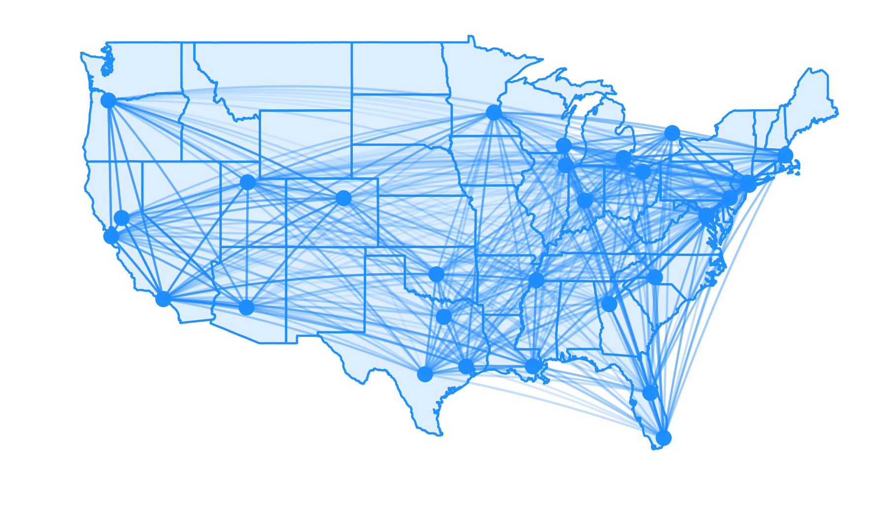

## My Idea

- Evaulate the travel burden of each NBA team this upcoming season
  - 30 NBA teams
  - Each team plays 82 games per year
  - Each team plays at each stadium at least once

## 30 Teams, 29 Stadiums

## Avg. Distance Between Stadiums

- Identified the nearest international airport to each NBA stadium
- Looked up the stadium's geo-coordinates
- Used R to measure the distance
  - geosphere package
  - distm() function
  - distVincentyEllipsoid parameter ("great circle distance")

## Avg. Distance Between Stadiums

## Evaluating Existing Schedule

- Accessed 2019-2020 schedule from [https://www.basketball-reference.com/leagues/NBA_2020_games.html](https://www.basketball-reference.com/leagues/NBA_2020_games.html)
- Assumptions:
  - Each team starts at home
  - Each team returns home during the All-Star Break
  - Each team returns home at the end of the season
  - Ignores playoffs

## 2019-2020 Travel Schedule

## Approx. Seasonal Air Travel

## There Appears to be a Problem...

- There seems to exist an unbalanced travel burden for the 30 NBA teams
  - higher/lower travel burdens could unknowingly affect schedule difficulty
- The NBA could fix this problem if they wanted to, but distance isn't their only concern when setting schedules
- So, let me see if I can propose a better, more balanced schedule

## Stay Tuned for the Full Presentation

* johnmatthewsugden@gmail.com
* http://www.github.com/johnsug/nba
